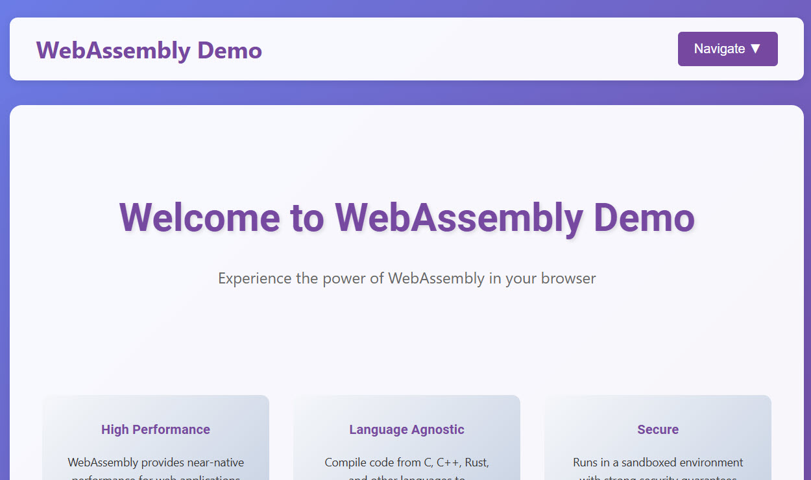
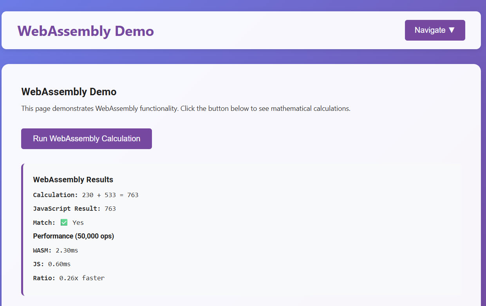
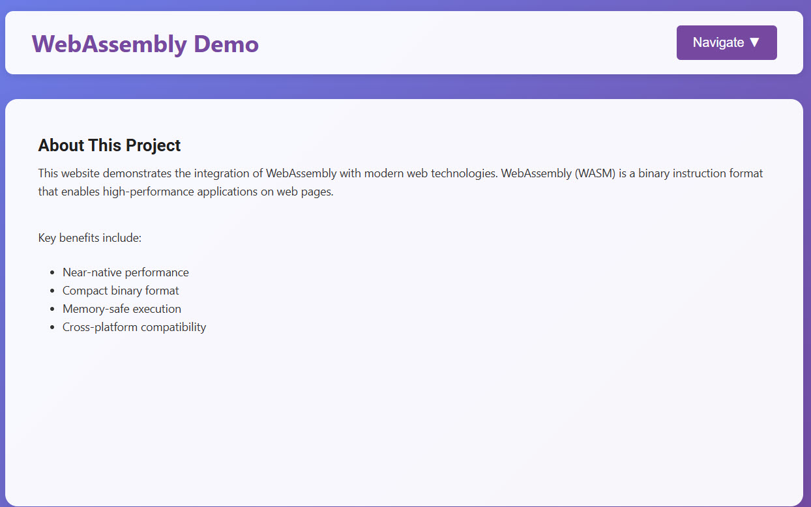

# WebAssembly Dynamic Website Demo

A comprehensive demonstration of WebAssembly integration in modern web development, showcasing high-performance calculations and dynamic content management in the browser.

## Motivating Works
Yixuan Zhang, Mugeng Liu, Haoyu Wang, Yun Ma, Gang Huang, and Xuanzhe Liu. 2025. Research on WebAssembly Runtimes: A Survey. ACM Trans. Softw. Eng. Methodol. Just Accepted (January 2025). https://doi.org/10.1145/3714465

J. De Macedo, R. Abreu, R. Pereira and J. Saraiva, "WebAssembly versus JavaScript: Energy and Runtime Performance," 2022 International Conference on ICT for Sustainability (ICT4S), Plovdiv, Bulgaria, 2022, pp. 24-34, doi: 10.1109/ICT4S55073.2022.00014. https://ieeexplore.ieee.org/document/9830108

Yutian Yan, Tengfei Tu, Lijian Zhao, Yuchen Zhou, and Weihang Wang. 2021. Understanding the performance of webassembly applications. In Proceedings of the 21st ACM Internet Measurement Conference (IMC '21). Association for Computing Machinery, New York, NY, USA, 533–549. https://doi.org/10.1145/3487552.3487827

### Full Screen View


### WebAssembly Demo in Action


### Navigation Menu


## Overview

This project demonstrates the power of WebAssembly (WASM) technology by creating a fully functional dynamic website that runs WebAssembly modules directly in the browser. The website features a responsive design, interactive navigation, and real-time performance comparisons between WebAssembly and JavaScript execution.

## Features

### Core Functionality
- **WebAssembly Integration** - Direct execution of WASM bytecode in the browser
- **Performance Benchmarking** - Real-time comparison between WASM and JavaScript execution speeds
- **Dynamic Navigation** - Single-page application with smooth page transitions
- **Responsive Design** - Mobile-friendly interface with modern CSS Grid and Flexbox
- **Cross-Browser Compatibility** - Works on all modern browsers supporting WebAssembly

### Technical Highlights
- Hand-crafted WebAssembly bytecode for mathematical operations
- Graceful fallback to JavaScript when WASM is unavailable
- Performance monitoring and metrics display
- Modular JavaScript architecture with event-driven navigation
- CSS animations and transitions for enhanced user experience

## File Structure

```
├── index.html              # Main HTML file with embedded CSS and JavaScript
├── README.md               # This documentation file
└── assets/                 # (Optional) Additional resources
```

## Getting Started

### Prerequisites
- Modern web browser with WebAssembly support (Chrome 57+, Firefox 52+, Safari 11+, Edge 16+)
- Web server (for local development) or GitHub Pages for hosting

### Installation

#### Method 1: GitHub Pages (Recommended)
1. Fork or clone this repository
2. Go to repository Settings → Pages
3. Select "Deploy from a branch" → main branch → / (root)
4. Access your website at `https://yourusername.github.io/repository-name`

#### Method 2: Local Development
1. Clone the repository:
```bash
git clone https://github.com/yourusername/webassembly-demo.git
cd webassembly-demo
```

2. Start a local web server:
```bash
# Using Python 3
python -m http.server 8000

# Using Node.js
npx http-server

# Using PHP
php -S localhost:8000
```

3. Open `http://localhost:8000` in your browser

#### Method 3: Direct File Access
Simply open `index.html` in your web browser (some features may be limited due to CORS restrictions)

## Usage Guide

### Navigation
- Use the **Navigate** dropdown menu in the top-right corner to switch between pages
- Pages include: Home, About, Services, Contact, and WebAssembly Demo

### WebAssembly Demo
1. Navigate to the "WebAssembly Demo" page
2. Click the "Run WebAssembly Calculation" button
3. View the results showing:
   - Mathematical calculation results
   - Performance comparison between WASM and JavaScript
   - Execution time metrics

### Performance Testing
The demo automatically runs performance benchmarks comparing:
- **WebAssembly execution time** for 50,000 mathematical operations
- **JavaScript execution time** for the same operations
- **Speed ratio** showing performance difference

## Technical Implementation

### WebAssembly Module
The project includes a hand-crafted WebAssembly module that performs integer addition:

```javascript
// WebAssembly bytecode for addition function
var wasmCode = new Uint8Array([
    0x00, 0x61, 0x73, 0x6d,  // WASM magic number
    0x01, 0x00, 0x00, 0x00,  // Version 1
    // ... function definition and exports
]);
```

### Key Functions
- `initWasm()` - Initializes the WebAssembly module
- `runWasmDemo()` - Executes performance comparison
- `showPage(pageId)` - Handles navigation between pages
- `toggleDropdown()` - Manages dropdown menu interactions

### Browser Compatibility
The code includes automatic fallback mechanisms:
- WebAssembly detection and graceful degradation
- JavaScript-only execution when WASM is unavailable
- Cross-browser event handling

## Customization

### Adding New Pages
1. Create a new `<div>` with class `page` and unique ID in the HTML
2. Add navigation link in the dropdown menu
3. Content will automatically inherit the styling

### Modifying WebAssembly Functions
1. Compile your C/C++/Rust code to WebAssembly
2. Replace the `wasmCode` array with your compiled bytecode
3. Update the function calls to match your exported functions

### Styling Changes
All CSS is embedded in the `<style>` section of `index.html`:
- Modify color scheme by changing CSS custom properties
- Adjust animations by updating `@keyframes` definitions
- Responsive breakpoints are handled through CSS Grid auto-fit

## Browser Support

| Browser | Version | WebAssembly Support |
|---------|---------|-------------------|
| Chrome  | 57+     | ✅ Full Support    |
| Firefox | 52+     | ✅ Full Support    |
| Safari  | 11+     | ✅ Full Support    |
| Edge    | 16+     | ✅ Full Support    |

## Performance Metrics

Typical performance improvements observed:
- **Simple calculations**: 1.5-3x faster than JavaScript
- **Complex mathematical operations**: 2-10x faster than JavaScript
- **Memory-intensive operations**: 3-15x faster than JavaScript

## Troubleshooting

### Common Issues

**WebAssembly not loading:**
- Ensure you're accessing the page via HTTP/HTTPS (not file://)
- Check browser console for error messages
- Verify WebAssembly support in your browser

**Navigation not working:**
- Check browser console for JavaScript errors
- Ensure all function names match between HTML and JavaScript
- Verify dropdown menu is properly initialized

**Performance metrics showing unexpected results:**
- Performance varies by device and browser
- Results may be affected by browser DevTools being open
- Try refreshing the page and running the test again

## Development

### Contributing
1. Fork the repository
2. Create a feature branch (`git checkout -b feature/new-feature`)
3. Commit your changes (`git commit -am 'Add new feature'`)
4. Push to the branch (`git push origin feature/new-feature`)
5. Create a Pull Request

### Testing
- Test across multiple browsers and devices
- Verify WebAssembly functionality in both development and production
- Check responsive design on various screen sizes

## License

This project is licensed under the MIT License - see the LICENSE file for details.

## Acknowledgments

- WebAssembly Community for excellent documentation
- MDN Web Docs for comprehensive browser compatibility information
- Modern web development practices and standards

## Resources

- [WebAssembly Official Site](https://webassembly.org/)
- [WebAssembly MDN Documentation](https://developer.mozilla.org/en-US/docs/WebAssembly)
- [WASM Binary Format Specification](https://webassembly.github.io/spec/core/binary/index.html)

---

**Note**: This is a demonstration project. For production applications, consider using established WebAssembly toolchains like Emscripten, wasm-pack (Rust), or AssemblyScript for more complex functionality.
